<div align="center">
  
  
  # 🚀 PReviwer
  
  ### AI-Powered Pull Request Analysis Platform
  
  <p align="center">
    <strong>Transform your code reviews with intelligent AI insights</strong><br>
    Automated PR analysis • Real-time feedback • Seamless GitHub integration
  </p>
  
  <p align="center">
    <a href="https://prviwer.vercel.app">🌐 Live Demo</a> •
    <a href="#features">✨ Features</a> •
    <a href="#installation">🛠️ Installation</a> •
    <a href="#usage">📖 Usage</a>
  </p>
  
  
  
  
  
</div>

---

## 🎯 What is PReviwer?

PReviwer is a cutting-edge platform that revolutionizes code reviews by leveraging advanced AI to analyze Pull Requests. It seamlessly integrates with GitHub to provide intelligent, actionable feedback that helps developers write better code, catch issues early, and maintain high code quality standards.

### ⚡ Why PReviwer?

- **🧠 AI-Powered Analysis**: Advanced machine learning models analyze your code for potential issues, security vulnerabilities, and performance optimizations
- **⚡ Real-time Feedback**: Get instant insights as soon as you create a pull request
- **🔒 Enterprise Security**: Built with security-first architecture including JWT authentication and encrypted token storage
- **🎯 Actionable Insights**: Receive specific, implementable suggestions rather than generic feedback
- **📊 Analytics Dashboard**: Track code quality metrics and improvement trends over time

---

## ✨ Features

<table>
  <tr>
    <td>
      
      <h3>🧠 AI-Powered Analysis</h3>
      <p>Uses advanced AI models (OpenAI, Anthropic, Google) to automatically analyze pull requests and generate insightful feedback on code quality, security, and performance.</p>
    </td>
    <td>
      
      <h3>🌐 GitHub Integration</h3>
      <p>Seamlessly integrates with GitHub REST APIs using Octokit, enabling users to fetch, analyze, and comment on PRs directly from the platform.</p>
    </td>
  </tr>
  <tr>
    <td>
      
      <h3>🔒 Security First</h3>
      <p>Enterprise-grade security with JWT authentication, encrypted token storage using CryptoJS, and secure MongoDB integration.</p>
    </td>
    <td>
      
      <h3>🎮 Interactive Playground</h3>
      <p>Test and configure AI models with custom system prompts, A/B test different configurations, and fine-tune analysis parameters.</p>
    </td>
  </tr>
  <tr>
    <td>
      
      <h3>⚡ Redis Caching</h3>
      <p>Lightning-fast performance with intelligent Redis caching, reducing API calls and improving response times significantly.</p>
    </td>
    <td>
      
      <h3>📊 Analytics Dashboard</h3>
      <p>Comprehensive analytics showing code quality trends, PR statistics, and improvement metrics with beautiful visualizations.</p>
    </td>
  </tr>
</table>

---

## 🏗️ Architecture

```mermaid
graph TB
    A[Frontend - Next.js] --> B[API Gateway]
    B --> C[Authentication Service]
    B --> D[GitHub Service]
    B --> E[AI Analysis Service]
    
    C --> F[MongoDB - User Data]
    D --> G[GitHub API]
    E --> H[OpenAI/Anthropic/Google AI]
    
    B --> I[Redis Cache]
    B --> J[Report Generation]
    
    style A fill:#61dafb
    style F fill:#47a248
    style G fill:#333
    style H fill:#ff6b6b
    style I fill:#dc382d
```



---

## 🛠️ Tech Stack

### Frontend
- **Framework**: Next.js 14 with TypeScript
- **Styling**: Tailwind CSS + Shadcn/ui
- **State Management**: React Context + Hooks
- **Icons**: Lucide React
- **Charts**: Recharts

### Backend
- **Runtime**: Node.js with Express.js
- **Database**: MongoDB with Mongoose
- **Caching**: Redis for performance optimization
- **Authentication**: JWT with GitHub OAuth
- **Security**: CryptoJS for token encryption

### AI & External APIs
- **AI Models**: OpenAI GPT-4, Anthropic Claude, Google Gemini
- **GitHub Integration**: Octokit for GitHub REST API
- **File Processing**: Advanced PR diff analysis

### DevOps & Deployment
- **Frontend Hosting**: Vercel
- **Backend Hosting**: Vercel Serverless Functions
- **Database**: MongoDB Atlas
- **Caching**: Redis Cloud

---

## 🚀 Quick Start

### Prerequisites

- Node.js 18+ and npm/yarn
- MongoDB database
- Redis instance
- GitHub OAuth App
- AI API keys (OpenAI/Anthropic/Google)

### Installation

1. **Clone the repository**
   ```bash
   git clone https://github.com/your-username/previwer.git
   cd previwer
   ```

2. **Install dependencies**
   ```bash
   # Install backend dependencies
   cd backend
   npm install
   
   # Install frontend dependencies
   cd ../frontend
   npm install
   ```

3. **Environment Configuration**

   Create `.env` files in both `backend` and `frontend` directories:

   **Backend `.env`:**
   ```env
   # Database
   MONGODB_URI=mongodb+srv://your-mongodb-uri
   REDIS_URL=redis://your-redis-url
   
   # Authentication
   JWT_SECRET=your-super-secret-jwt-key
   GITHUB_CLIENT_ID=your-github-client-id
   GITHUB_CLIENT_SECRET=your-github-client-secret
   
   # Security
   ENCRYPTION_KEY=your-32-char-encryption-key
   
   # AI APIs
   OPENAI_API_KEY=your-openai-key
   ANTHROPIC_API_KEY=your-anthropic-key
   GOOGLE_API_KEY=your-google-key
   
   # Server
   PORT=5000
   NODE_ENV=development
   ```

   **Frontend `.env.local`:**
   ```env
   NEXT_PUBLIC_API_URL=http://localhost:5000/api
   NEXTAUTH_SECRET=your-nextauth-secret
   NEXTAUTH_URL=http://localhost:3000
   ```

4. **Run the application**
   ```bash
   # Start backend (in backend directory)
   npm run dev
   
   # Start frontend (in frontend directory) 
   npm run dev
   ```

5. **Access the application**
   - Frontend: http://localhost:3000
   - Backend API: http://localhost:5000

---

## 📖 Usage

### Getting Started

1. **🔐 Authentication**
   - Visit the application and click "Login with GitHub"
   - Authorize PReviwer to access your GitHub repositories
   - You'll be redirected to your personalized dashboard

2. **⚙️ Configure AI Models**
   - Navigate to the Playground section
   - Configure your preferred AI provider (OpenAI, Anthropic, or Google)
   - Set up system prompts and test configurations
   - Save your optimal settings

3. **📊 Analyze Pull Requests**
   - Go to your Dashboard to see your GitHub statistics
   - Select any repository and PR for analysis
   - View AI-generated insights and recommendations
   - Generate detailed reports with actionable feedback

4. **🎮 Advanced Features**
   - Use the Playground to A/B test different AI configurations
   - Generate templated reports with custom variables
   - View analytics and trends in your code quality
   - Export reports for team sharing

### API Endpoints

<details>
<summary>Click to view API documentation</summary>

#### Authentication
- `POST /api/auth/github` - GitHub OAuth login
- `POST /api/auth/refresh` - Refresh JWT token
- `POST /api/auth/logout` - Logout user

#### GitHub Integration
- `GET /api/github/user` - Get user profile
- `GET /api/github/repos` - Get user repositories
- `GET /api/github/pr/:owner/:repo/:number` - Get PR details
- `POST /api/github/analyze` - Analyze PR with AI

#### Playground
- `GET /api/playground/config` - Get playground configuration
- `POST /api/playground/configure` - Configure AI model
- `POST /api/playground/test` - Test system prompt
- `POST /api/playground/generate` - Generate analysis report

#### Cache Management
- `POST /api/cache/clear-analysis-data` - Clear analysis cache
- `DELETE /api/cache/pr/:owner/:repo/:number` - Clear specific PR cache

</details>

---

## 🔧 Configuration

### AI Model Configuration

PReviwer supports multiple AI providers. Configure them in the Playground:

```javascript
// Example configuration
{
  "llm_provider": "openai",
  "llm_model": "gpt-4",
  "temperature": 0.7,
  "max_tokens": 2000,
  "system_prompt": "You are an expert code reviewer...",
  "secondary_system_prompt": "Focus on security and performance..."
}
```

### Custom System Prompts

Create powerful analysis templates with variables:

```
Analyze this {{PR_TYPE}} pull request for {{REPO_NAME}}.
Files changed: {{FILES_CHANGED}}
Lines added: {{LINES_ADDED}}
Lines removed: {{LINES_REMOVED}}

Focus areas:
- Code quality and best practices
- Security vulnerabilities  
- Performance implications
- Testing coverage
```

---

## 🔒 Security

PReviwer implements enterprise-grade security measures:

- **🛡️ JWT Authentication**: Secure token-based authentication with GitHub OAuth
- **🔐 Token Encryption**: All tokens encrypted using CryptoJS before MongoDB storage
- **🚫 Data Privacy**: No code is stored permanently; only analysis results are cached
- **🔄 Auto Token Refresh**: Automatic token refresh for uninterrupted service
- **⚡ Rate Limiting**: Built-in rate limiting to prevent API abuse
- **🌐 CORS Protection**: Properly configured CORS for secure cross-origin requests

---

## 🤝 Contributing

We welcome contributions! 

### Development Workflow

1. Fork the repository
2. Create a feature branch: `git checkout -b feature/amazing-feature`
3. Make your changes and add tests
4. Commit your changes: `git commit -m 'Add amazing feature'`
5. Push to the branch: `git push origin feature/amazing-feature`
6. Open a Pull Request

### Code Style

- Follow TypeScript best practices
- Use Prettier for code formatting
- Write meaningful commit messages
- Add tests for new features

---

## 📊 Roadmap

### 🎯 Current Version (v2.0)
- ✅ Multi-AI provider support
- ✅ Advanced playground configuration
- ✅ Redis caching implementation
- ✅ Comprehensive analytics dashboard
- ✅ Template-based report generation

### 🚀 Upcoming Features (v2.1)
- 🔄 Real-time PR monitoring
- 📱 Mobile app development
- 🤖 Custom AI model training
- 👥 Team collaboration features
- 📈 Advanced metrics and insights

### 🌟 Future Plans (v3.0)
- 🔗 IDE integrations (VS Code, IntelliJ)
- 🌍 Multi-platform support (GitLab, Bitbucket)
- 🧪 Automated testing suggestions
- 🎨 Custom UI themes
- 📚 Knowledge base integration

---

## 📄 License

This project is licensed under the MIT License - see the [LICENSE](LICENSE) file for details.

---

## 🙏 Acknowledgments

- **GitHub** for providing excellent APIs and OAuth integration
- **OpenAI, Anthropic, Google** for powerful AI models
- **Vercel** for seamless deployment and hosting
- **MongoDB** for reliable database services
- **Redis** for high-performance caching

---

## 📞 Support

- 📧 **Email**: shobhit141142@gmail.com
- 🐛 **Issues**: [GitHub Issues](https://github.com/Shobhit141141/previwer/issues)

---

<div align="center">
  <p>
    <strong>Made with ⚡ by Shobhit Tiwari</strong>
  </p>
  <p>
    <a href="https://prviwer.vercel.app">Try PReviwer Today</a> • 
    <a href="https://github.com/Shobhit141141/previwer">Star on GitHub</a>
  </p>
</div>
